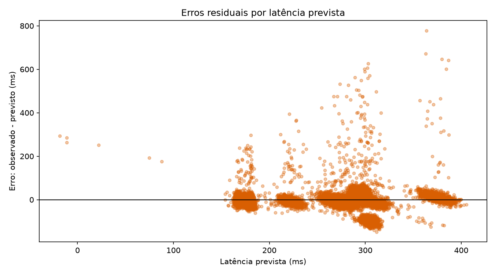

# Relatório Técnico - SCIC Aurora Siger.
Grupo:  
PEDRO CESAR FERNANDES DE BRITO,  
Gabriel Coutinho Barcelos,  
Matheus de Carvalho Teodoro,  
Luis Gustavo Ribeiro Andrade,  
João Victor Viana Feitosa  


# Fase 6 - SCIC

O objetivo da missão da fase é construir um Sistema de Comunicação Interplanetária da Colônia. As missões principais que precisávamos resolver são:  
* Coleta e organização dos dados;
* Cálculo dos indicadores;
* Modelo de Previsão com Avaliação;
* Priorização de Alertas com Heap;
* Consulta de Módulos com Trie;
* Geração do Relatório.

Cada ponto abordamos de uma forma diferente no processo, mas geramos todos em uma estrutura única de desenvolvimento.

## Estrutura do desenvolvimento.

Durante a construção do código, optamos por uma técnica de código mais limpo, onde dividimos tudo em classes, e cada execução estará voltada como uma classe. Dessa forma, o nosso arquivo principal apenas chamará a classe do SCIC e executará uma função que vai executar toda a estratégia principal.

Essa forma, facilita a manutenção do código, além de ficar mais alinhado com a técnica SOLID, uma vez que temos Single Responsability, e Open-Closed Principles.

Como podemos reparar, isso minimiza a quantidade de linhas de códigos dos nossos arquivos. Essa técnica de separarmos as funções por arquivos semelhantes, se chama Modularização, e utilizarmos de Classes para fazer essa Modularização nos permite deixar o código mais genérico e replicável.

## Coleta e organização dos dados.

Ao iniciarmos a classe do SCIC, estamos inicialmente realizando os pontos de chamada da nossa classe GeradorDados(), isso faz com que possamos capturar informações compartilhadas entre essas duas classes, e caso o arquivo com os dados simulados não exista, estaremos realizando a execução do Gerador de Dados para que o arquivo passa a existir no caminho desejado. Note que utilizando a modularização por classes, podemos compartilhar os caminhos com um único comando. Dessa forma, minimizamos trabalho duplicado, em caso de termos que alterar o caminho de output, e o caminho de leitura dos dados.

A organização dos dados se dá pelo formato de .csv, e o arquivo é salvo na pasta .dados do repositório. Facilitando assim o acesso a pasta.

## Menu de opções e pontos que resolvem

Dentro do nosso SCIC, geramos um Menu de opções, sendo que cada um desses pontos do Menu são chamados para resolver um ponto adicional das informações que estão por ali.

No menu, temos ali as seguintes opções:
```
1 - Consultar registros
2 - Analisar indicadores
3 - Modelo de previsão
4 - Gerenciar Alertas
5 - Buscar módulos
6 - Analisar consumo e eletricidade
7 - Sair
```

Cada menu resolve um problema, e utiliza de uma técnica ensinada em aula.

Os principais pontos resolvidos pelo Menu são:
> __Consultar Registros:__ Consulta os dados gerados pelos dados simulados.  
__Analisar indicadores:__ Calcula os indicadores dos dados, mostrando os principais pontos que devemos ter atenção.  
__Modelo de previsão:__ Realiza o modelo de regressão linear com os dados existêntes e avalia a qualidade do modelo resolvido.  
__Gerenciar Alertas:__ Gerenciamento de alertas, com uma fila de prioridade com uma estrutura de MaxHeap.  
__Buscar módulos:__ Busca os módulos existentes com base na estrutura de uma Trie.
__Analisar consumo e eletricidade:__ Realiza a análise do consumo e da eletricidade dos pontos 

Pelo menu, podemos analisar que maior parte dos nossos grandes problemas estão resolvidos pelo processo. Mas vamos destrinchar melhor cada tópico.

## Consultar Registros

Utilizando da nossa estrutura, ao chamarmos a função de consultar registros, somos enviados a uma classe de Consulta de Registros. Essa classe vai receber os dados lidos pelo SCIC e utilizar para realizar as nossas primeiras visualizações.

O Consultar Registros é um dos módulos mais simples, ele trabalha com manipulações de DataFrames Pandas.

Dentro da própria classe, temos um outro menu. Ali, decidimos qual próximo passo vamos seguir, podemos exibir os primeiros registros, que vai exibir o .head do dataframe, o que exibe últimos registros, que vai mostrar agora o .tail, e as outras funções do Menu, vai mostrar para nós o dataframe com filtros aplicados.

## Análise dos indicadores.

No nosso menu 2, temos um relatório com uma análise dos nossos indicadores gerais.

Fazemos algumas análises da latência média e máxima, carga e potência média, e também algumas métricas de porcentagem que operações que está normalizada, e quantidade que está contando como crítico e alerta.

Além disso, temos uma primeira análise de erros, onde o sistema vai receber no seu dado de salvo, o tempo que a mensagem deveria ter chegado até o SCIC e o tempo que ela chegou, ou seja, a latência prevista sem termos modelo, prevista com base na arquitetura da colônia, e a latência observada. Esse erro foi analisado com base no erro absoluto médio e erro relativo. Ideal para avaliarmos se estamos com muitas variações do que o mundo ideal, e precisamos ou não alterar a arquitetura da colônia para otimizarmos a distribuição dos módulos.

Temos um erro absoluto médio de 16.49 ms, e um erro relativo de 5.25%. Ambos os erros ainda estão em níveis baixos, dentro do esperado, e dentro do normal, dessa forma, não precisamos nos preocupar com essas variações de latência, que pode ter acontecido por uma concorrência ou outro tópico.

## Modelo de Previsão.

O nosso modelo de previsão é uma regressão linear, onde o nosso objetivo é encontrarmos os coeficientes do modelo, e podemos fazer a avaliação do modelo.

O formato do modelo de previsão, não utilizei de uma classe separada, tentei formatar a estrutura dentro do próprio código do SCIC, mas está como um dos pontos de alterar e fazer em em uma classe separada, fazendo em uma classe separada, o código ficaria mais limpo, e mais fácil de manutenir.

O nosso modelo tem um menu com treinar e exibir modelo, exibir previsões do modelo, exibir dados modelo, prever nova observação, exibir coeficientes do modelo e gerar os gráficos do erro para avaliarmos.

Os gráficos são salvos na pasta dos dados, e serve para darmos mais fundamentos para nossa análise do modelo.

### Treino do modelo.

Durante o treino do modelo, fomos percebendo algumas ligações não lineares entre algumas variáveis explicativas e a variável explicada. Dessa forma, tentamos capturar algumas análises desses pontos na nossa regressão múltipla.

Entrando no nosso menu, acessando o menu 3, entramos em um menu interno do nosso modelo. Se apertarmos 1 novamente, treinamos o modeo e exibiremos no console os resultados do modelo. Utilizando a técnica de mínimos Quadrados Ordinários para variávels dos dados que possuímos, temos que um MAE (Mean Absolute Error) de 33.26, o que pode indicar de fato um valor um pouco alto, mas isoladamente não conseguimos analisar esses pontos.

Na mesma frente, capturamos também o MSE (Mean Squared Error), onde capturamos o Erro médio Quadrático, e com o valor de 3679.85, acredito que estamos de fato com uma regressão pouco significativa. A regressão linear utilizando Mínimo dos Quadrados Ordinários tenta reduzir o erro da média quadrática. Esse valor em magnitude tão alta, indica que talvez o modelo não esteja na melhor forma para analisarmos os dados.

Logo em seguida temos o RMSE, que é a Raiz Quadrada do Erro Quadrático Médio. O RMSE costuma ser analisado quando queremos analisar o erro na mesma dimensão da variável explicada. O valor encontrado de RMSE é de 60.662, um valor também um pouco elevado para nosso problema.

Por último, temos o $R^2$. O $R^2$ vem da soma dos quadrados dos resíduos e dividimos pela soma dos quadrados totais retirados do 1, dessa forma, nosso $R^2$ está sempre entre 0 e 1. O $R^2$ indica um coeficiente de determinação do modelo. Nosso $R^2$ no modelo aparece como 0.471. Um valor realmente baixo. Esse parâmetro quando mais próximo de 1, melhor. Mas devemos também ter cuidado com _overfits_. 

Tudo indica que nosso modelo ainda não consegue explicar a latência como queremos explicar. Nossas métricas de erros ainda estão muito elevadas. O nosso $R^2$ nos mostra que nossa linha do modelo estatístico não está ajustando tão bem assim com os dados das nossas variáveis explicativas, e nossas outras análises de erros também nos informa uma taxa de variação de erro muito grande, se compararmos com a proporção dos dados que estamos querendo explicar.

Um ponto relevante, que podemos adicionar aqui, é que precisamos fazer algumas transformações monotônicas, para conseguirmos otimizar um pouco melhor nossos parâmetros. Um exemplo é que adicionamos no nosso modelo log_carga, log_tensão, e corrente quadrada. Podemos observar os Beta-parâmetros no menu 5 do nosso modelo.

### Análise do modelo.

Apesar de tentarmos adicionar algumas manipulações monotônicas para tentarmos explicar o modelo da melhor forma, os dados que tínhamos ainda não era suficiente para conseguirmos chegar em um modelo de previsão mais confiável. O modelo que chegamos tem um poder de chegar próximo em 47% dos casos, ainda assim considera um valor muito baixo, e uma taxa de variação muito alta.

Podemos observar essa taxa alta de variação com base na imagem abaixo:



Podemos perceber que apesar de termos ali uma quantidade alta próxima da variação do erro, ao analisarmos quando prevemos uma latência mais alta, temos uma porcentagem de erros maiores, e com magnitudes muito superiores ao que estamos calculando. Isso nos mostra que talvez estejamos esquecendo de analisar algum ponto que não temos disponíveis.

Uma coisa que me chamou atenção, é na magnitude dos erros, podemos observar que quando nosso modelo calcula uma latência próxima ou superior a 200, estamos com uma média de erros de aproximadamente 2 vezes maior nosso previsto. Podemos observar com a variação de previsão de 400, que estamos com erros de observado - previsto de 800, ou seja, só o nosso observado é 3x superior ao que prevemos. Existe então alguma tendência que não foi observada pelo modelo.

Vale ressaltar que nessa análise que estamos fazendo, não estamos utilizando de uma única métrica para avaliarmos nosso modelo, que nosso $R^2$ apesar de estar relativamente baixo, não é suficiente para avaliarmos se o modelo explica bem nosso problema. Podemos perceber existe uma tendência não capturada pelos erros através do Erro Absoluto Médio estar relativamente baixo, mas o erro quadrático médio assumir valores tão altos, isso quer dizer que temos observações que estão com uma distância do previsto muito grande. Tal ponto não conseguiria observar analisando apenas o $R^2$.

## Priorização de Alertas com Heap

Durante nosso processo de geração do código, utilizamos a estrutura de Heap para conseguirmos gerar uma fila de prioridades dos nossos alertas.

A estrutura é gerada da mesma forma que os outros tópicos, um menu em outra classe, modularizado. O nome dessa classe é Gerenciador de Alertas.

Nosso menu do gerenciador de alertas é bem simples, nos permite visualizar o próximo alerta, o mais prioritário, adiconar um alerta, e também retirarmos nosso alerta da fila de prioridade.

Nosso Heap é estruturado em outra classe, na pasta estruturas_baixo_nivel, onde todos os parâmetros são codados.

Apesar do Heap ser representado como uma árvore binária, podemos também representar no formato de array, com o índice a esquerda do nó pai sendo um nó com índice de 2i+1 e o da direita de 2i+2. Assim não temos problemas nunca de resolvermos esses pontos, e estamos sempre balanceamento dos tópicos.

Implementar o array em Python nos permitiu não usarmos de um array de nós para armazenarmos os alertas, fizemos um array de tuplas, onde o primeiro é a prioridade do alerta, e o segundo item são os dados do Alerta em uma dataclass gerada para adicionar esse valor.

Utilizamos a estrutura de um MaxHeap para a priorização do alerta. A estrutura que fizemos para calcularmos a prioridade é analisarmos primeiro os pontos com status crítico, depois o que o status está somente como Alerta, e depois vemos os normais, mas sempre analisamos o que o nível de observação for crítico primeiro. Depois fizemos um ajuste que vamos corrigir sempre os alertas mais antigos, com o intuito de resolvermos os problemas. Ou seja, na fórmula, capturamos o ciclo de medição, e fizemos uma simples subtração pelo ciclo, assim, punimos os ciclos mais recentes.

A vantagem do Heap em comparação com uma estrutura de lista simples é que aqui podemos manter sempre nossa estrutura balanceada, com o maior valor de prioridade sempre no topo, e conseguimos também manter toda a estrutura organizada com menos passos, logo estamos trabalhando com uma notação assintótica menor do que se lidarmos com listas simples.

Para utilizar o sistema de alertas, basta digitar 4 no nosso menu principal.


## Busca de registro com Trie.

Outra estrutura aprendida ao longo da fase e utilizado também nas nossas análises foi o Trie. O Trie funciona como uma árvore mas com diversos galhos, e com uma forma simples de conseguirmos fazer uma análise de início de palavras.

O Trie funciona da seguinte forma. Temos o nó com dois parâmetros para analisar um dicionário de nós filhos, e um booleano se é ou não o fim de uma palavra. Dessa forma, a estrutura vai passando os nós apenas verificando se a próxima letra está ou não nos nós filhos. 

Para acessar nossa busca de módulos, basta digitar 5 no nosso menu padrão.

No Menu secundário do Buscador de Módulos, temos um ponto onde verificamos o nome completo do módulo, sem o uso do prefixo, aqui tentamos seguir o caminho completo da palavra, se alguma letra não estiver no nó filho de algum outro tópico, ou se ao chegarmos no final da palavra o nó não for o final de uma palavra na nossa Trie, retornamos False.

Temos também no menu secundário, a verificação de existência pelo prefixo. A lógica é a mesma, exceto pelo final da anterior, não fazemos a análise se a letra é um final de palavra da Trie, vamos retornar True se o caminho do prefixo que estamos buscando estiver completo até o final do prefixo.

O terceiro ponto do menu secundário é o retorno dos nomes dos módulos pelo prefixo. Ele inicia buscando a árvore pelos galhos da palavra que colocamos inicialmente, e depois ele vai iterando por todas as ramificações até o final da palavra e vai montando todos os módulos com aquele prefixo.

A estrutura de dados *Trie* é adequada para consultas por prefixo porque organiza as informações de forma hierárquica, armazenando cada caractere de uma chave em um caminho dentro da estrutura. Dessa forma, registros que possuem o mesmo início compartilham os mesmos nós, permitindo localizar rapidamente todos os registros que correspondem a determinado prefixo sem a necessidade de percorrer toda a base de dados. No contexto da colônia, essa característica pode acelerar a localização de informações, como módulos, sensores ou identificadores de sistemas, permitindo que uma consulta por um prefixo específico encontre rapidamente os registros relacionados. Além disso, a busca apresenta custo proporcional ao tamanho do prefixo pesquisado, tornando a *Trie* especialmente eficiente para sistemas que realizam consultas frequentes por identificadores ou padrões iniciais.

## Dispositivos, bases numéricas e eletricidade básica aplicada à comunicação

O SCIC utiliza dados simulados que representam informações que, em uma aplicação real, poderiam ser coletadas por **sensores e medidores** instalados nos módulos da Aurora Siger. Como saída, o sistema apresenta os resultados por meio do **terminal e de relatórios**, permitindo o acompanhamento das condições operacionais.

As interfaces de comunicação, como redes cabeadas, Wi-Fi ou Bluetooth, são consideradas de forma conceitual, pois o projeto não implementa dispositivos físicos.

Os códigos dos sensores também podem ser representados em diferentes bases numéricas. Por exemplo:

$$
173_{10} = 10101101_2 = AD_{16}
$$

O sistema também utiliza conceitos básicos de eletricidade para calcular a potência dos módulos:

$$
P = V \times I
$$

Assim, para um módulo com 220 V e 2 A:

$$
P = 220 \times 2 = 440W
$$

Dessa forma, o SCIC relaciona dispositivos de entrada e saída, representação de dados e eletricidade básica ao monitoramento da comunicação.

---

## Gerenciamento inteligente da comunicação

O SCIC representa, de forma simplificada, um sistema de gerenciamento inteligente da comunicação da Aurora Siger. Os dados simulados representam informações que poderiam ser coletadas continuamente por sensores e medidores inteligentes.

O monitoramento de **latência, carga, condições elétricas e alertas** permite identificar comportamentos anormais. A comparação entre latência prevista e observada também possibilita identificar desvios que podem indicar situações que necessitam de atenção.

A utilização de **Heap** permite priorizar os alertas mais críticos, enquanto a **Trie** facilita a localização de módulos e sensores por prefixo. O armazenamento histórico dos dados também pode apoiar estratégias de manutenção preditiva.

Em uma implementação real, enlaces redundantes poderiam manter a comunicação em caso de falhas, enquanto os dados elétricos poderiam ser utilizados em conjunto com sistemas de gerenciamento de energia e microrredes.

Assim, o SCIC demonstra como **sensores, monitoramento, análise, automação e estruturas de dados** podem trabalhar em conjunto para apoiar o gerenciamento inteligente da comunicação.

---

## Reflexão social, cultural e sustentável

O SCIC também deve considerar os impactos do uso de tecnologias inteligentes sobre as pessoas e os recursos da Aurora Siger.

O monitoramento de **energia, potência e comunicação** pode contribuir para a sustentabilidade ao permitir identificar desperdícios e utilizar os recursos disponíveis de forma mais eficiente.

A preocupação com o uso responsável dos recursos também pode ser relacionada à valorização de conhecimentos tradicionais e ao respeito à natureza, reforçando a importância de decisões sustentáveis na operação da colônia.

Os resultados do sistema devem ser apresentados de forma **transparente e compreensível**, permitindo que os operadores entendam os critérios utilizados para gerar alertas e previsões.

Por fim, o SCIC deve ser entendido como uma ferramenta de **apoio à decisão**. A classificação automática de um alerta não substitui a avaliação humana, que permanece responsável por validar os resultados e decidir quais ações devem ser tomadas.
